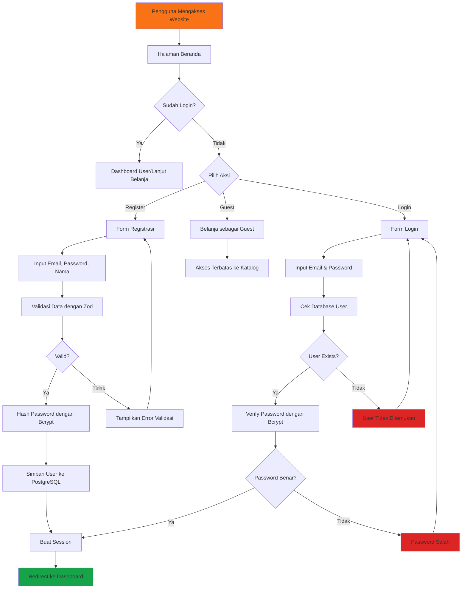
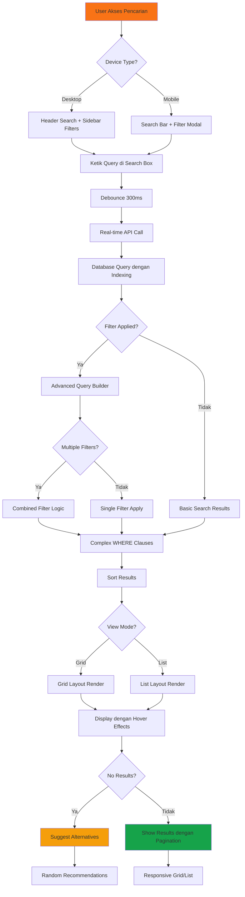
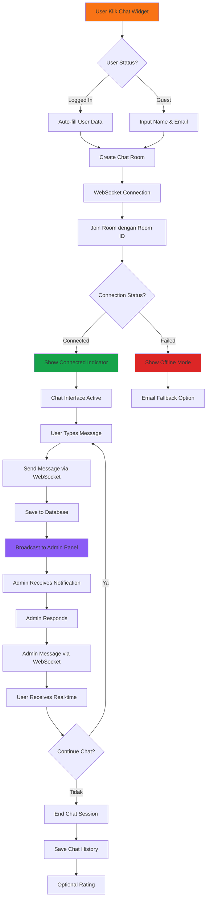
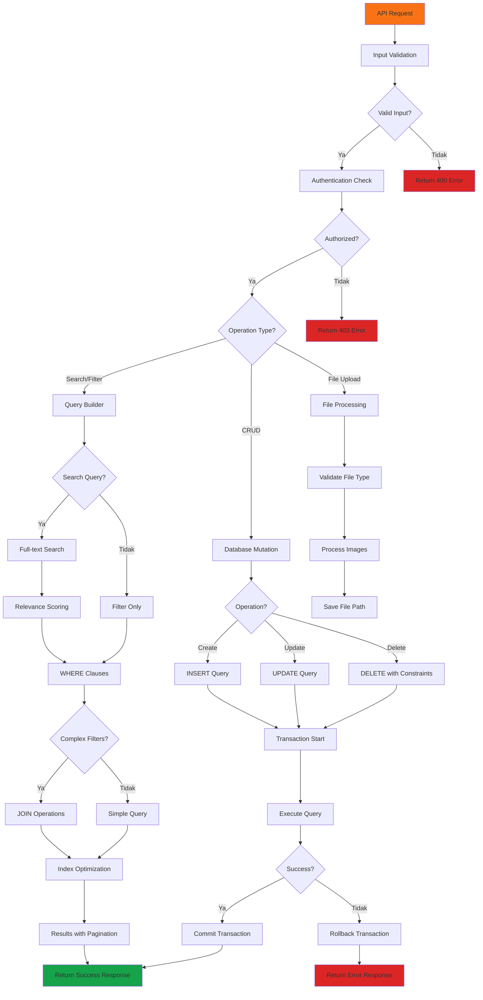
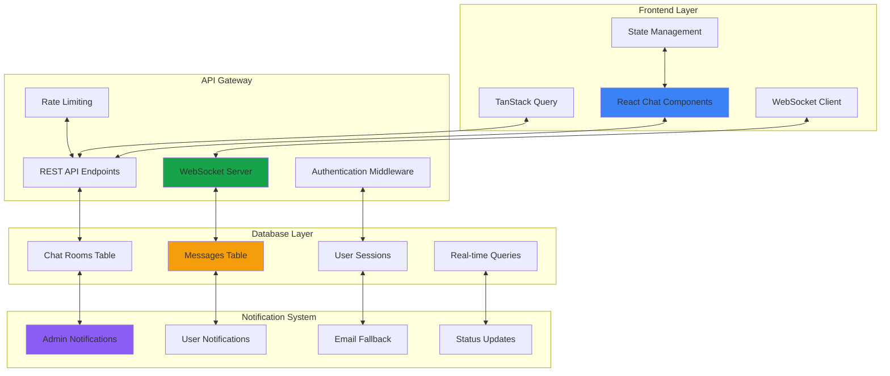
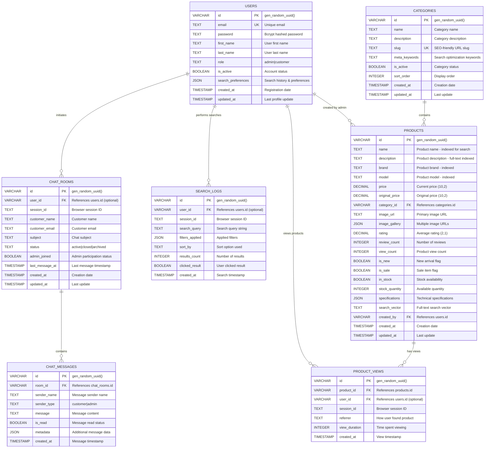
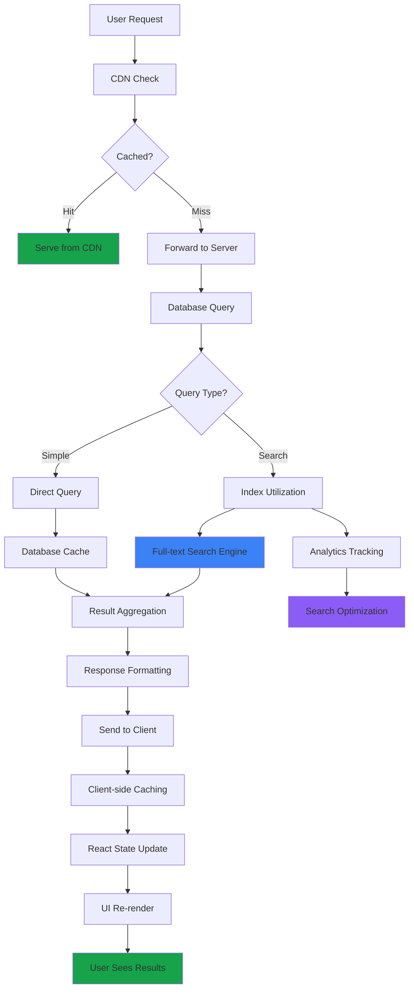
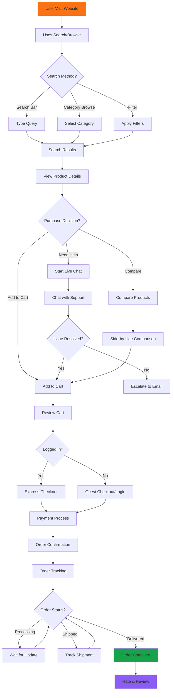
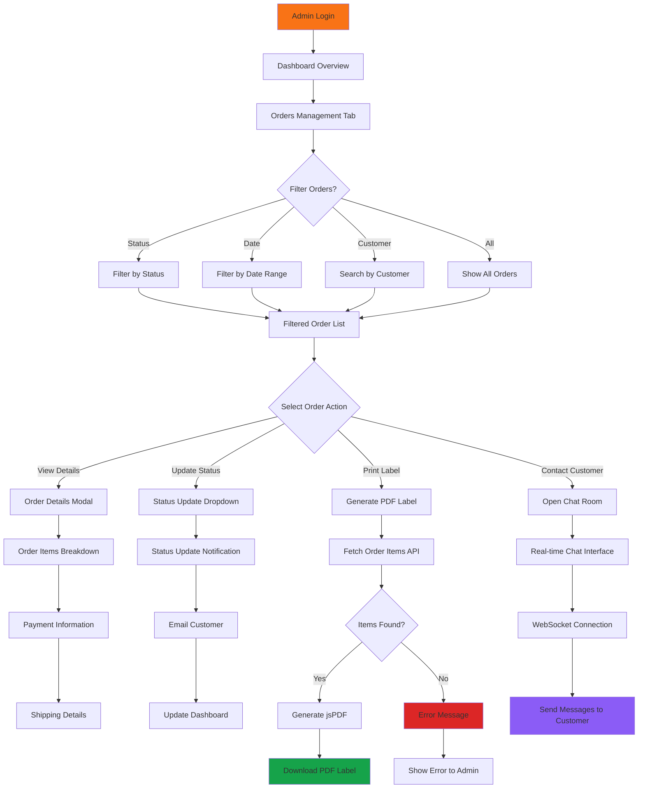

# System Flowchart - Hurtrock Music Store

**Copyright 2024 Fajar Julyana. All rights reserved.**

## Alur Pengguna (User Flow)

### 1. Alur Autentikasi Pengguna



### 2. Enhanced Search & Filter Flow



### 3. Real-time Chat System Flow



### 4. Advanced Admin Panel Flow

```mermaid
flowchart TD
    %% Admin Access
    A[Admin Akses /admin] --> B{Authentication?}
    B -->|Valid| C[Admin Dashboard]
    B -->|Invalid| D[Login Required]

    %% Admin Dashboard Actions
    C --> E{Admin Action?}
    E -->|Products| F[Product Management]
    E -->|Categories| G[Category Management]
    E -->|Orders| H[Order Management]
    E -->|Chat| I[Chat Management]
    E -->|Users| J[User Management]

    %% Product Management
    F --> K{Product Action?}
    K -->|Add| L[Add Product Form]
    K -->|Edit| M[Edit Product Form]
    K -->|Delete| N[Delete Confirmation]
    K -->|Search| O[Admin Product Search]

    L --> P[Image Upload (Max 5)]
    M --> P2[Image Upload (Max 5)]
    P --> Q[Validation & Save]
    P2 --> Q

    %% Order Management
    H --> R{Order Action?}
    R -->|View| S[Order Details]
    R -->|Update Status| T[Status Update]
    R -->|Print Label| U[Generate PDF Label]

    S --> V[Order Items Breakdown]
    T --> W[Notify Customer]
    U --> X[Download PDF]

    %% Chat Management
    I --> Y[Active Chat Rooms List]
    Y --> Z{Chat Action?}
    Z -->|Open| AA[Join Chat Room]
    Z -->|Close| BB[Archive Chat]

    AA --> CC[WebSocket Admin Connection]
    CC --> DD[Real-time Chat Interface]

    %% Category Management
    G --> EE{Category Action?}
    EE -->|Add| FF[Add Category Form]
    EE -->|Edit| GG[Edit Category Form]
    EE -->|Delete| HH[Delete with Validation]

    FF --> II[Auto-generate SEO Slug]
    GG --> II
    HH --> JJ{Products Using Category?}
    JJ -->|Yes| KK[Cannot Delete]
    JJ -->|No| LL[Delete Success]

    %% Node Styling
    style C fill:#16a34a,stroke:#000,stroke-width:1px
    style D fill:#dc2626,stroke:#000,stroke-width:1px
    style X fill:#3b82f6,stroke:#000,stroke-width:1px
    style DD fill:#8b5cf6,stroke:#000,stroke-width:1px
    style KK fill:#dc2626,stroke:#000,stroke-width:1px
```

### 5. Enhanced Database Operations Flow



## Enhanced System Architecture

### 6. Real-time Communication Architecture



### 7. Advanced Search Architecture



### 8. Performance Optimization Flow



## Complete User Journey Flows

### 9. End-to-End Shopping Flow dengan Search



### 10. Admin Workflow untuk Order Management



**Key Enhancements dalam Flowchart Terbaru:**

### Fitur Pencarian & Filter Canggih:
1. **Real-time Search**: Debounced search dengan instant results
2. **Advanced Filtering**: Multiple filter combinations
3. **Smart Recommendations**: Alternative suggestions untuk no results
4. **Performance Optimization**: Indexed queries dan caching strategies

### Live Chat System:
1. **WebSocket Integration**: Real-time bidirectional communication
2. **Admin Panel Integration**: Centralized chat management
3. **Persistent History**: Chat history tersimpan untuk referensi
4. **Status Management**: Online/offline indicators dan fallback options

### Enhanced Admin Features:
1. **Comprehensive Order Management**: Status updates dengan PDF generation
2. **Advanced Product Management**: Multiple image uploads dengan validation
3. **Category Management**: SEO-friendly slugs dengan referential integrity
4. **Real-time Chat Support**: Direct chat dengan customers

### Database Architecture:
1. **Search Optimization**: Full-text search vectors dan indexed fields
2. **Analytics Integration**: Search logs dan view tracking
3. **Performance Monitoring**: Query optimization dan caching strategies
4. **Real-time Features**: WebSocket data persistence

### Security & Performance:
1. **Enhanced Authentication**: Role-based access dengan session management
2. **Input Validation**: Comprehensive Zod schemas
3. **Rate Limiting**: API protection dari abuse
4. **Optimized Queries**: Database indexing untuk fast search

**Developed by Fajar Julyana**

*Flowchart terbaru ini mencerminkan evolusi sistem menjadi platform e-commerce yang fully-featured dengan advanced search capabilities, real-time communication, dan comprehensive admin management tools.*
