# System Flowchart - Hurtrock Music Store

**Copyright 2024 Fajar Julyana. All rights reserved.**

## Alur Pengguna (User Flow)

### 1. Alur Autentikasi Pengguna

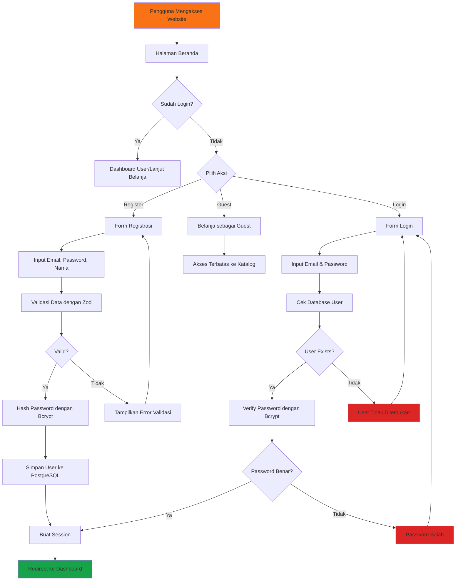

### 2. Enhanced Search & Filter Flow

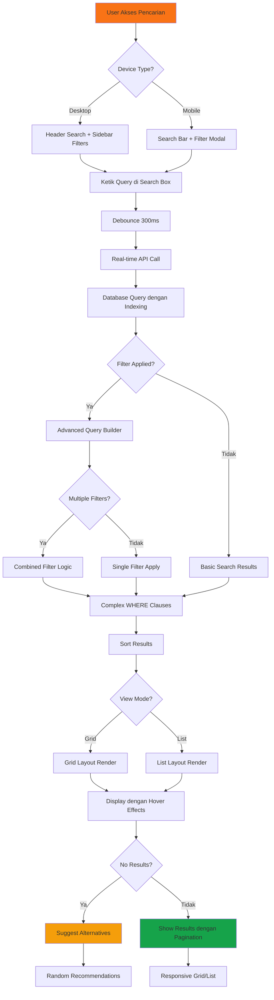

### 3. Real-time Chat System Flow

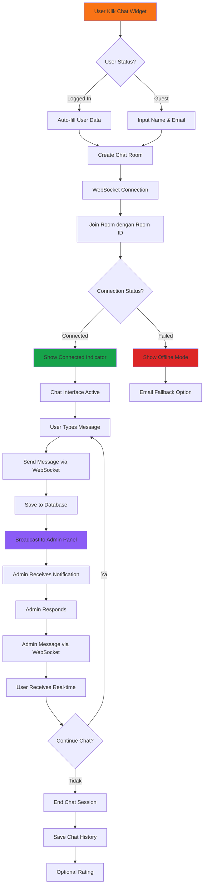

### 4. Enhanced Order Management Flow dengan Tracking

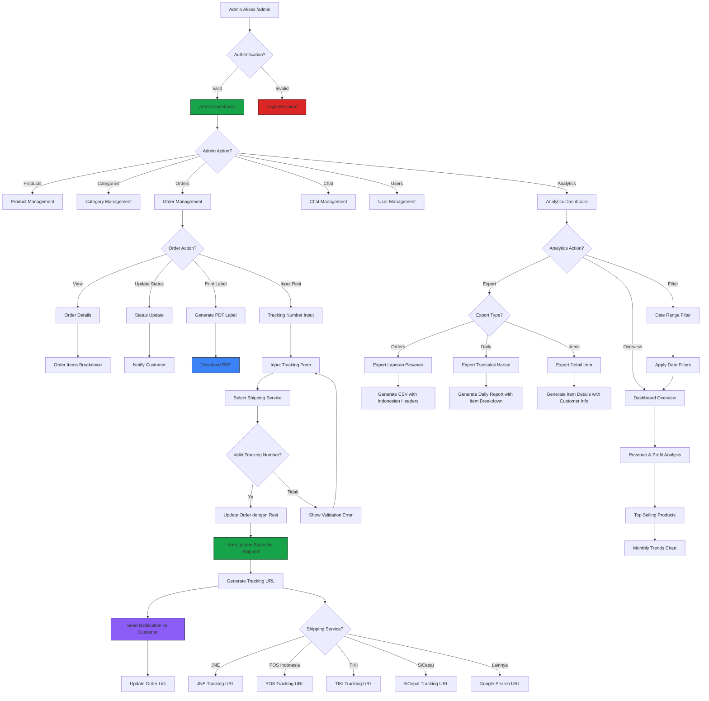

### 5. Customer Order Tracking Flow

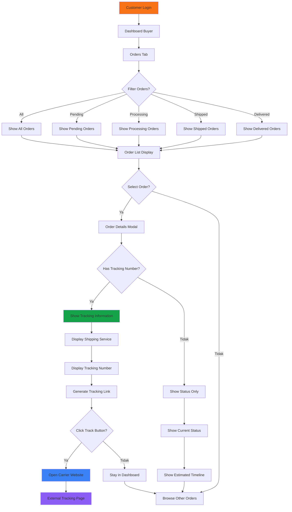

### 6. Complete Order Lifecycle Flow

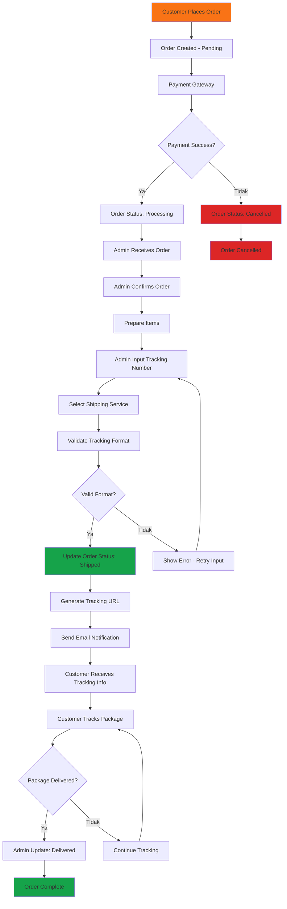

### 7. Enhanced Database Operations Flow dengan Tracking

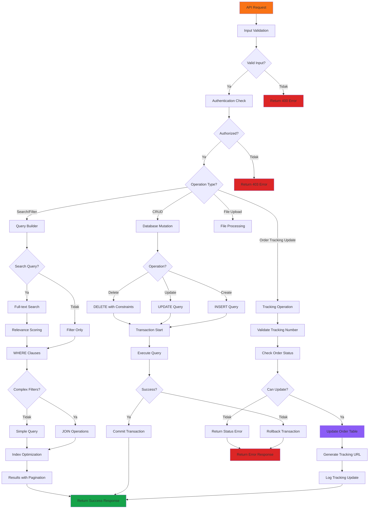

## Enhanced System Architecture

### 8. Order Tracking Architecture

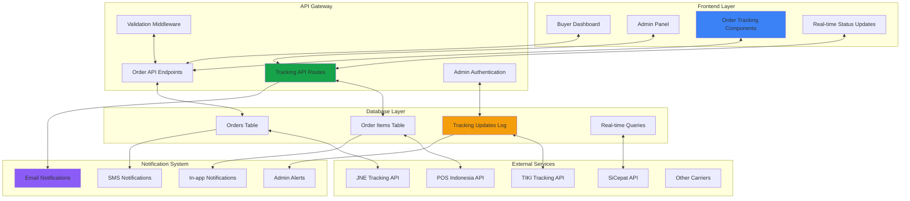

### 9. Enhanced Database Schema dengan Tracking

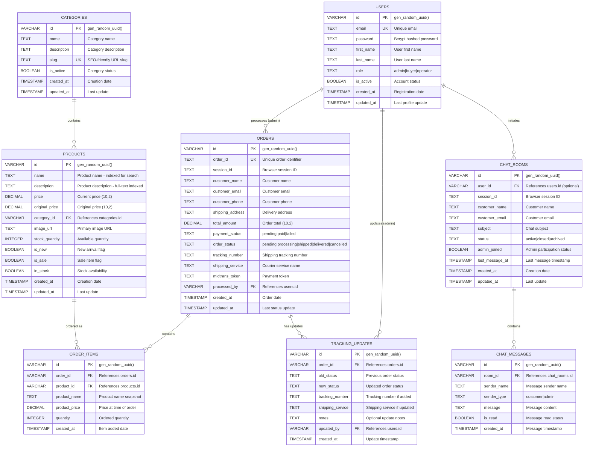

### 10. Enhanced Performance Optimization Flow

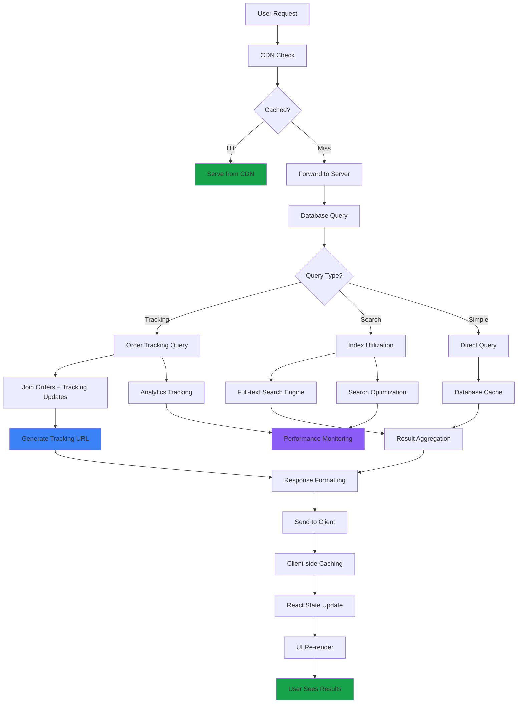

## Complete User Journey Flows

### 11. End-to-End Shopping Flow dengan Tracking

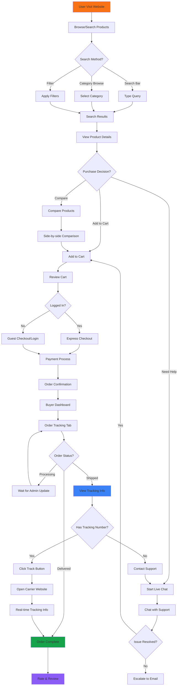

### 12. Admin Workflow untuk Complete Order Management

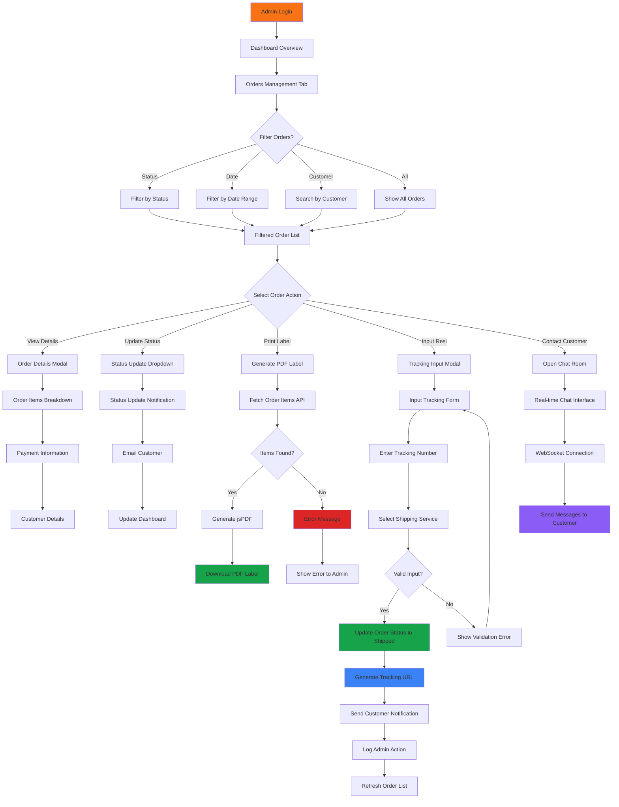

**Key Enhancements dalam Flowchart Terbaru:**

### Fitur Order Tracking System:
1. **Manual Tracking Input**: Admin dapat input nomor resi dengan dropdown jasa pengiriman
2. **Auto Status Update**: Status otomatis berubah ke "shipped" saat resi diinput
3. **Tracking URL Generation**: Auto-generate link tracking ke website kurir
4. **Customer Notifications**: Email/SMS notification saat tracking diupdate
5. **Real-time Updates**: Buyer dashboard menampilkan tracking info real-time

### Enhanced Order Management:
1. **Complete Order Lifecycle**: From pending hingga delivered dengan tracking
2. **Multi-Carrier Support**: JNE, POS Indonesia, TIKI, SiCepat, Anteraja, J&T
3. **Validation System**: Format tracking number validation per carrier
4. **Admin Action Logging**: Audit trail untuk semua perubahan order
5. **Customer Communication**: Integrated chat dan notification system

### Database Architecture Improvements:
1. **Tracking Updates Table**: Log semua perubahan status dengan timestamp
2. **Enhanced Orders Table**: Tambah shipping_service dan tracking_number fields
3. **Performance Optimization**: Indexed queries untuk tracking lookups
4. **Real-time Capabilities**: WebSocket support untuk instant updates

### Security & Performance:
1. **Admin Authentication**: Role-based access untuk order management
2. **Input Validation**: Comprehensive validation untuk tracking data
3. **Rate Limiting**: API protection untuk tracking updates
4. **Caching Strategy**: Optimize frequent tracking queries

### Customer Experience:
1. **Buyer Dashboard**: Dedicated tracking tab dengan real-time status
2. **External Tracking Links**: Direct links ke website kurir
3. **Status Notifications**: Email/SMS untuk setiap perubahan status
4. **Mobile-Friendly**: Responsive tracking interface untuk semua device

**Developed by Fajar Julyana**

*Flowchart terbaru ini mencerminkan evolusi sistem menjadi platform e-commerce yang fully-featured dengan comprehensive order tracking, real-time communication, dan advanced admin management tools untuk pengalaman berbelanja yang seamless.*

