# 📊 Flowchart Sistem Hurtrock Music Store

**Copyright © 2024 Fajar Julyana. All rights reserved.**

## 🛒 Alur Pengguna (User Flow)

### **1. Alur Belanja Pelanggan**

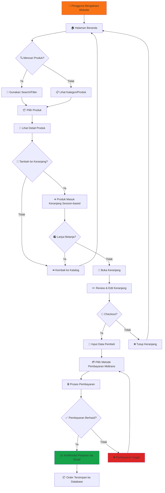

### **2. Alur Kontak Customer Service**

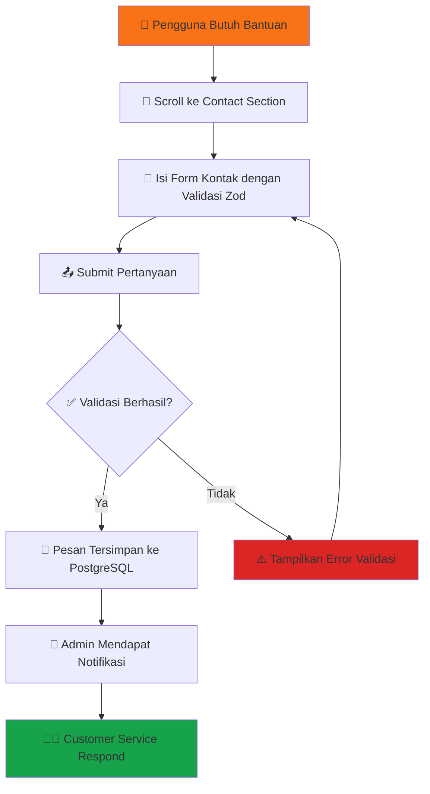

### **3. Alur Multi-bahasa & Internasionalisasi**

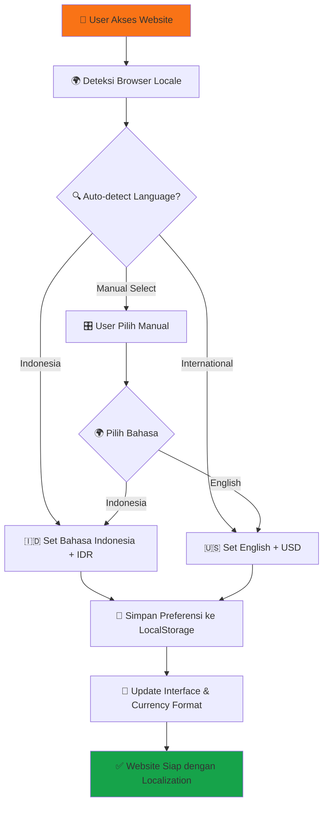

## 👨‍💼 Alur Admin/Developer

### **4. Alur Autentikasi Admin**

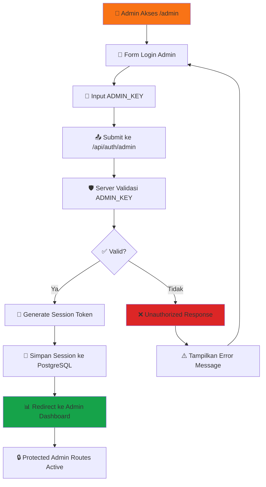

### **5. Alur Manajemen Produk Admin**

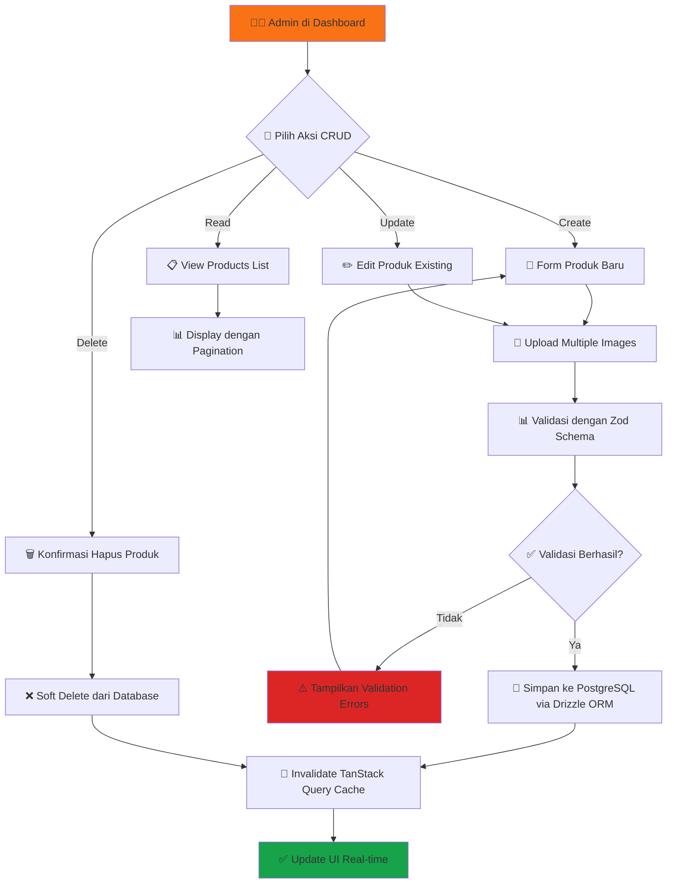

### **6. Alur Sistem Pembayaran Midtrans Terintegrasi**

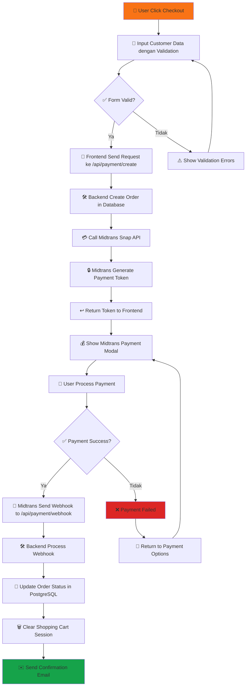

## 🏗️ Arsitektur Sistem Terbaru

### **7. Alur Arsitektur Full-Stack dengan Database**

```mermaid
flowchart TB
    subgraph "🌐 Frontend Layer (React + TypeScript + Vite)"
        A1[📱 React Components dengan Shadcn/UI]
        A2[🛒 Shopping Cart dengan Session Persistence]
        A3[💳 Midtrans Payment Integration]
        A4[👨‍💼 Admin Panel dengan Auth Protection]
        A5[🌍 Localization Context dengan Auto-detection]
        A6[🔍 TanStack Query State Management]
    end
    
    subgraph "🔄 API Layer (Express.js + TypeScript)"
        B1[📦 Products CRUD API dengan Validation]
        B2[🛒 Session-based Cart API]
        B3[💳 Payment API dengan Webhook Handler]
        B4[🔐 Authentication API dengan Session]
        B5[📧 Contact Form API dengan Email]
        B6[📂 Categories Management API]
    end
    
    subgraph "💾 Database Layer (PostgreSQL + Drizzle ORM)"
        C1[📦 Products Table dengan Images]
        C2[📂 Categories Table dengan Relations]
        C3[🛒 Cart Items Table Session-based]
        C4[📋 Orders Table dengan Customer Info]
        C5[🖼️ Product Images Table dengan URLs]
        C6[📧 Contact Submissions Table]
        C7[👤 Sessions Table untuk Auth & Cart]
    end
    
    subgraph "☁️ External Services & APIs"
        D1[💰 Midtrans Payment Gateway]
        D2[📧 Email Service untuk Notifications]
        D3[🌐 Replit Deployment Platform]
        D4[📊 Database Hosting (Neon/Railway)]
    end
    
    A1 <--> B1
    A2 <--> B2
    A3 <--> B3
    A4 <--> B4
    A5 <--> B5
    A6 <--> B1
    
    B1 <--> C1
    B2 <--> C3
    B3 <--> C4
    B4 <--> C7
    B5 <--> C6
    B6 <--> C2
    
    B3 <--> D1
    B5 <--> D2
    C1 <--> D3
    C7 <--> D4
    
    style A1 fill:#3b82f6
    style B1 fill:#16a34a
    style C1 fill:#f59e0b
    style D1 fill:#dc2626
```

### **8. Alur State Management dengan TanStack Query**

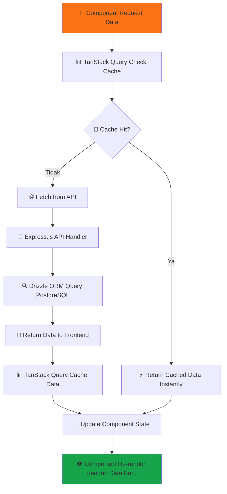

## 📱 Enhanced Mobile & Responsive Flow

### **9. Alur Responsive Design dengan Tailwind**

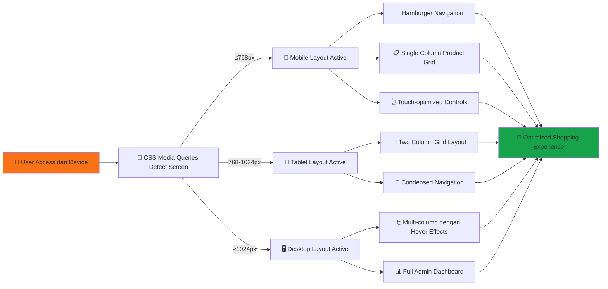

## 🔐 Security & Authentication Flow

### **10. Alur Keamanan Multi-layer**

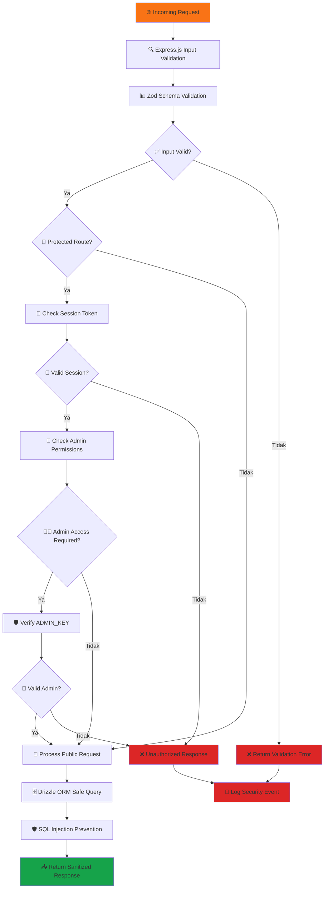

## 🚀 Development & Deployment Flow di Replit

### **11. Alur Development Lifecycle**

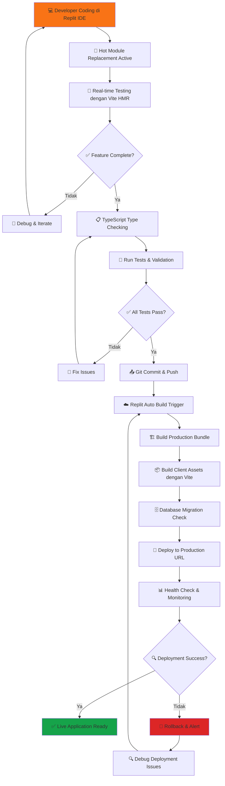

## 🗄️ Entity Relationship Diagram (ERD)

### **12. Database Schema & Relations**

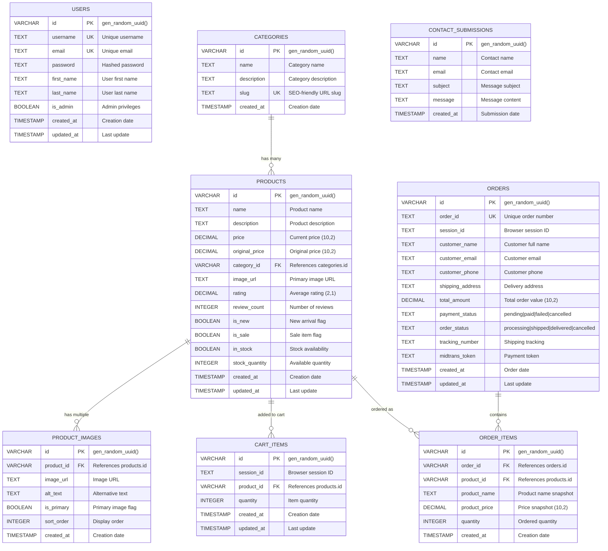

### **13. Database Constraints & Indexes**

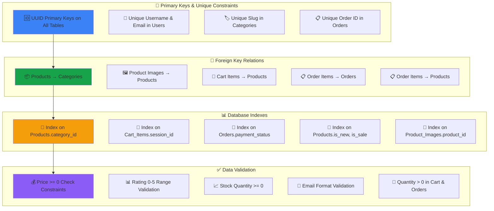

## 📊 Data Flow dengan PostgreSQL

### **14. Alur Data Persistence**

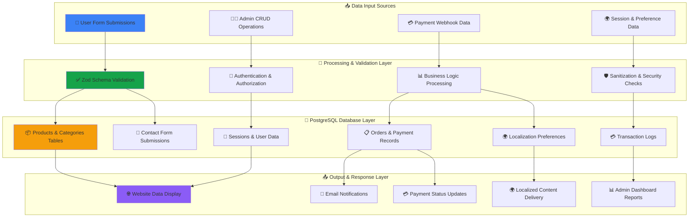

---

## 📋 Legenda Flowchart & ERD Terbaru

### **Flowchart Symbols:**
| Simbol | Arti | Penggunaan Konteks |
|--------|------|--------------------|
| 🏠 | Homepage | Landing page dengan hero section |
| 👤 | User/Customer | End users yang berbelanja |
| 👨‍💼 | Admin | System administrator dengan ADMIN_KEY |
| 📦 | Products | Catalog items dengan multiple images |
| 🛒 | Shopping Cart | Session-based cart persistence |
| 💳 | Payment | Midtrans payment gateway integration |
| 📱 | Mobile Responsive | Touch-optimized mobile interface |
| 🖥️ | Desktop Interface | Full-featured desktop experience |
| 💾 | PostgreSQL Database | Persistent data storage dengan Drizzle ORM |
| ☁️ | Replit Platform | Cloud development dan hosting environment |
| ✅ | Success State | Successful operations atau validations |
| ❌ | Error State | Failed operations atau validation errors |
| 🔄 | Processing | Ongoing operations atau state transitions |
| 📊 | TanStack Query | Client-side state management dan caching |
| 🌍 | Internationalization | Multi-language support dengan auto-detection |
| 🔐 | Authentication | Session-based auth dengan ADMIN_KEY |
| 🛡️ | Security | Input validation, SQL injection prevention |
| 📧 | Email Integration | Notifications dan contact form responses |

### **ERD Symbols & Notation:**
| Simbol | Arti | Penggunaan Database |
|--------|------|--------------------|
| PK | Primary Key | Unique identifier untuk setiap record |
| FK | Foreign Key | Reference ke primary key table lain |
| UK | Unique Key | Unique constraint selain primary key |
| `||--o{` | One-to-Many | Relasi satu ke banyak (e.g., Category → Products) |
| `||--||` | One-to-One | Relasi satu ke satu (rare dalam sistem ini) |
| `}o--o{` | Many-to-Many | Relasi banyak ke banyak (melalui junction table) |
| VARCHAR | Variable Character | String dengan max length |
| TEXT | Text Field | Unlimited length string |
| DECIMAL(10,2) | Decimal Number | Numeric dengan 10 digits, 2 decimal places |
| INTEGER | Whole Number | Bilangan bulat |
| BOOLEAN | True/False | Boolean value |
| TIMESTAMP | Date/Time | Tanggal dan waktu dengan timezone |

## 🔧 Database Performance & Security Features

### **15. Performance Optimization Strategy**

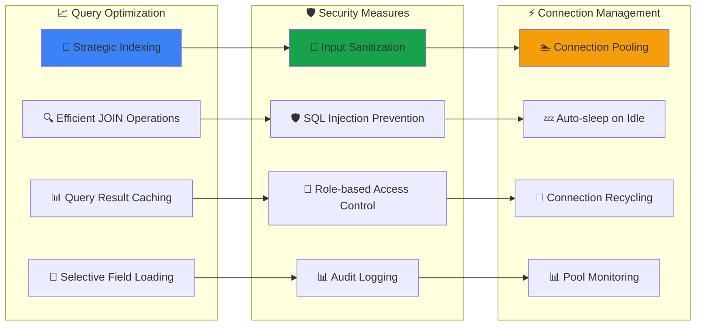

### **16. Database Migration & Seeding Flow**

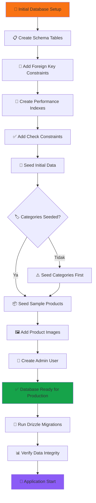

---

## 🎯 Key System Improvements

### **Enhanced Features dalam Flowchart & ERD:**

1. **Session-based Authentication**: ADMIN_KEY authentication dengan PostgreSQL session storage
2. **Database Persistence**: Complete PostgreSQL integration dengan Drizzle ORM dan ERD documentation
3. **Real-time State Management**: TanStack Query untuk optimal caching dan synchronization
4. **Enhanced Security**: Multi-layer validation dengan Zod schemas dan SQL injection prevention
5. **Advanced Internationalization**: Auto-detection browser locale dengan currency conversion
6. **Production-ready Payment**: Full Midtrans webhook integration dengan order tracking
7. **Responsive Design**: Mobile-first approach dengan Tailwind breakpoint optimization
8. **Developer Experience**: Hot module replacement dengan comprehensive error handling
9. **Database Design**: Comprehensive ERD dengan proper constraints dan performance indexes
10. **Data Integrity**: Foreign key relationships dengan referential integrity enforcement

---

**Developed by Fajar Julyana**

*Flowchart ini mencerminkan arsitektur lengkap sistem Hurtrock Music Store dengan teknologi modern, keamanan berlapis, dan user experience yang optimal untuk semua platform.*

