# 📊 Flowchart Sistem Hurtrock Music Store

**Copyright © 2024 Fajar Julyana. All rights reserved.**

## 🛒 Alur Pengguna (User Flow)

### **1. Alur Autentikasi Pengguna**

```mermaid
flowchart TD
    A[👤 Pengguna Mengakses Website] --> B[🏠 Halaman Beranda]
    B --> C{🔐 Sudah Login?}

    C -->|Ya| D[✅ Dashboard User/Lanjut Belanja]
    C -->|Tidak| E{📝 Pilih Aksi}

    E -->|Register| F[📝 Form Registrasi]
    E -->|Login| G[🔑 Form Login]
    E -->|Guest| H[🛒 Belanja sebagai Guest]

    F --> I[📧 Input Email, Password, Nama]
    I --> J[✅ Validasi Data dengan Zod]
    J --> K{✅ Valid?}

    K -->|Ya| L[🔐 Hash Password dengan Bcrypt]
    K -->|Tidak| M[⚠️ Tampilkan Error Validasi]

    L --> N[💾 Simpan User ke PostgreSQL]
    N --> O[🎫 Buat Session]
    O --> P[✅ Redirect ke Dashboard]

    G --> Q[📧 Input Email & Password]
    Q --> R[🔍 Cek Database User]
    R --> S{👤 User Exists?}

    S -->|Ya| T[🔐 Verify Password dengan Bcrypt]
    S -->|Tidak| U[❌ User Tidak Ditemukan]

    T --> V{✅ Password Benar?}
    V -->|Ya| O
    V -->|Tidak| W[❌ Password Salah]

    M --> F
    U --> G
    W --> G
    H --> X[🛒 Akses Terbatas ke Katalog]

    style A fill:#f97316
    style P fill:#16a34a
    style U fill:#dc2626
    style W fill:#dc2626
```

### **2. Enhanced Search & Filter Flow**

```mermaid
flowchart TD
    A[🔍 User Akses Pencarian] --> B{📱 Device Type?}

    B -->|Desktop| C[🖥️ Header Search + Sidebar Filters]
    B -->|Mobile| D[📱 Search Bar + Filter Modal]

    C --> E[⌨️ Ketik Query di Search Box]
    D --> E

    E --> F[⏱️ Debounce 300ms]
    F --> G[🔄 Real-time API Call]
    G --> H[🗄️ Database Query dengan Indexing]

    H --> I{📊 Filter Applied?}
    I -->|Ya| J[🔍 Advanced Query Builder]
    I -->|Tidak| K[📄 Basic Search Results]

    J --> L{🎯 Multiple Filters?}
    L -->|Ya| M[⚡ Combined Filter Logic]
    L -->|Tidak| N[🔧 Single Filter Apply]

    M --> O[📊 Complex WHERE Clauses]
    N --> O
    K --> O

    O --> P[📈 Sort Results]
    P --> Q{🎨 View Mode?}

    Q -->|Grid| R[🔲 Grid Layout Render]
    Q -->|List| S[📋 List Layout Render]

    R --> T[✨ Display dengan Hover Effects]
    S --> T

    T --> U{🔍 No Results?}
    U -->|Ya| V[💡 Suggest Alternatives]
    U -->|Tidak| W[✅ Show Results dengan Pagination]

    V --> X[🎲 Random Recommendations]
    W --> Y[📱 Responsive Grid/List]

    style A fill:#f97316
    style W fill:#16a34a
    style V fill:#f59e0b
```

### **3. Real-time Chat System Flow**

```mermaid
flowchart TD
    A[💬 User Klik Chat Widget] --> B{👤 User Status?}

    B -->|Logged In| C[✅ Auto-fill User Data]
    B -->|Guest| D[📝 Input Name & Email]

    C --> E[📋 Create Chat Room]
    D --> E

    E --> F[🌐 WebSocket Connection]
    F --> G[🔗 Join Room dengan Room ID]

    G --> H{🔌 Connection Status?}
    H -->|Connected| I[🟢 Show Connected Indicator]
    H -->|Failed| J[🔴 Show Offline Mode]

    I --> K[💬 Chat Interface Active]
    J --> L[📧 Email Fallback Option]

    K --> M[⌨️ User Types Message]
    M --> N[📤 Send Message via WebSocket]
    N --> O[💾 Save to Database]

    O --> P[📢 Broadcast to Admin Panel]
    P --> Q[👨‍💼 Admin Receives Notification]

    Q --> R[👨‍💼 Admin Responds]
    R --> S[📤 Admin Message via WebSocket]
    S --> T[📱 User Receives Real-time]

    T --> U{💬 Continue Chat?}
    U -->|Ya| M
    U -->|Tidak| V[📝 End Chat Session]

    V --> W[💾 Save Chat History]
    W --> X[⭐ Optional Rating]

    style A fill:#f97316
    style I fill:#16a34a
    style J fill:#dc2626
    style P fill:#8b5cf6
```

### **4. Advanced Admin Panel Flow**

```mermaid
flowchart TD
    A[👨‍💼 Admin Akses /admin] --> B{🔐 Authentication?}

    B -->|Valid| C[📊 Admin Dashboard]
    B -->|Invalid| D[🔒 Login Required]

    C --> E{🎯 Admin Action?}

    E -->|Products| F[📦 Product Management]
    E -->|Categories| G[📂 Category Management]
    E -->|Orders| H[📋 Order Management]
    E -->|Chat| I[💬 Chat Management]
    E -->|Users| J[👥 User Management]

    %% Product Management Flow
    F --> K{📦 Product Action?}
    K -->|Add| L[➕ Add Product Form]
    K -->|Edit| M[✏️ Edit Product Form]
    K -->|Delete| N[🗑️ Delete Confirmation]
    K -->|Search| O[🔍 Admin Product Search]

    L --> P["🖼️ Image Upload (Max 5)"]
    M --> P
    P --> Q[✅ Validation & Save]

    %% Order Management Flow
    H --> R{📋 Order Action?}
    R -->|View| S[👁️ Order Details]
    R -->|Update Status| T[🔄 Status Update]
    R -->|Print Label| U[📄 Generate PDF Label]

    S --> V[📊 Order Items Breakdown]
    T --> W[📢 Notify Customer]
    U --> X[📥 Download PDF]

    %% Chat Management Flow
    I --> Y[💬 Active Chat Rooms List]
    Y --> Z{💬 Chat Action?}
    Z -->|Open| AA[💬 Join Chat Room]
    Z -->|Close| BB[🔒 Archive Chat]

    AA --> CC[🌐 WebSocket Admin Connection]
    CC --> DD[💬 Real-time Chat Interface]

    %% Category Management Flow
    G --> EE{📂 Category Action?}
    EE -->|Add| FF[➕ Add Category Form]
    EE -->|Edit| GG[✏️ Edit Category Form]
    EE -->|Delete| HH[🗑️ Delete with Validation]

    FF --> II[🔤 Auto-generate SEO Slug]
    GG --> II
    HH --> JJ{🔍 Products Using Category?}
    JJ -->|Ya| KK[❌ Cannot Delete]
    JJ -->|Tidak| LL[✅ Delete Success]

    style C fill:#16a34a
    style D fill:#dc2626
    style X fill:#3b82f6
    style DD fill:#8b5cf6
    style KK fill:#dc2626
```

### **5. Enhanced Database Operations Flow**

```mermaid
flowchart TD
    A[🌐 API Request] --> B[🔍 Input Validation]
    B --> C{✅ Valid Input?}

    C -->|Ya| D[🛡️ Authentication Check]
    C -->|Tidak| E[❌ Return 400 Error]

    D --> F{👤 Authorized?}
    F -->|Ya| G{📊 Operation Type?}
    F -->|Tidak| H[❌ Return 403 Error]

    %% Different Database Operations
    G -->|Search/Filter| I[🔍 Query Builder]
    G -->|CRUD| J[📝 Database Mutation]
    G -->|File Upload| K[📁 File Processing]

    %% Search & Filter Operations
    I --> L{🔍 Search Query?}
    L -->|Ya| M[🔎 Full-text Search]
    L -->|Tidak| N[📊 Filter Only]

    M --> O[📈 Relevance Scoring]
    N --> P[🔧 WHERE Clauses]
    O --> P

    P --> Q{🎯 Complex Filters?}
    Q -->|Ya| R[⚡ JOIN Operations]
    Q -->|Tidak| S[📄 Simple Query]

    R --> T[🗂️ Index Optimization]
    S --> T
    T --> U[📊 Results with Pagination]

    %% CRUD Operations
    J --> V{📝 Operation?}
    V -->|Create| W[➕ INSERT Query]
    V -->|Update| X[✏️ UPDATE Query]
    V -->|Delete| Y[🗑️ DELETE with Constraints]

    W --> Z[🔒 Transaction Start]
    X --> Z
    Y --> Z

    Z --> AA[📊 Execute Query]
    AA --> BB{✅ Success?}
    BB -->|Ya| CC[✅ Commit Transaction]
    BB -->|Tidak| DD[🔄 Rollback Transaction]

    %% File Operations
    K --> EE[📁 Validate File Type]
    EE --> FF[🖼️ Process Images]
    FF --> GG[💾 Save File Path]

    CC --> HH[📤 Return Success Response]
    DD --> II[❌ Return Error Response]
    U --> HH

    style A fill:#f97316
    style HH fill:#16a34a
    style E fill:#dc2626
    style H fill:#dc2626
    style II fill:#dc2626
```

## 📊 Enhanced System Architecture

### **6. Real-time Communication Architecture**

```mermaid
flowchart TB
    subgraph "🌐 Frontend Layer"
        A1[⚛️ React Chat Components]
        A2[🔌 WebSocket Client]
        A3[📊 TanStack Query]
        A4[🎯 State Management]
    end

    subgraph "🔄 API Gateway"
        B1[📡 REST API Endpoints]
        B2[🌐 WebSocket Server]
        B3[🔐 Authentication Middleware]
        B4[📊 Rate Limiting]
    end

    subgraph "💾 Database Layer"
        C1[🗄️ Chat Rooms Table]
        C2[💬 Messages Table]
        C3[👥 User Sessions]
        C4[📊 Real-time Queries]
    end

    subgraph "🔔 Notification System"
        D1[📢 Admin Notifications]
        D2[📱 User Notifications]
        D3[📧 Email Fallback]
        D4[🔄 Status Updates]
    end

    A1 <--> B1
    A2 <--> B2
    A3 <--> B1
    A4 <--> A1

    B1 <--> C1
    B2 <--> C2
    B3 <--> C3
    B4 <--> B1

    C1 <--> D1
    C2 <--> D2
    C3 <--> D3
    C4 <--> D4

    style A1 fill:#3b82f6
    style B2 fill:#16a34a
    style C2 fill:#f59e0b
    style D1 fill:#8b5cf6
```

### **7. Advanced Search Architecture**

### **8. Performance Optimization Flow**

```mermaid
flowchart TD
    A[🌐 User Request] --> B[🔄 CDN Check]
    B --> C{📦 Cached?}
    
    C -->|Hit| D[⚡ Serve from CDN]
    C -->|Miss| E[🖥️ Forward to Server]
    
    E --> F[🔍 Database Query]
    F --> G{📊 Query Type?}
    
    G -->|Search| H[🗂️ Index Utilization]
    G -->|Simple| I[📄 Direct Query]
    
    H --> J[🔎 Full-text Search Engine]
    I --> K[💾 Database Cache]
    
    J --> L[📊 Result Aggregation]
    K --> L
    
    L --> M[🎨 Response Formatting]
    M --> N[📤 Send to Client]
    
    N --> O[🖥️ Client-side Caching]
    O --> P[⚛️ React State Update]
    
    P --> Q[🎯 UI Re-render]
    Q --> R[✅ User Sees Results]
    
    %% Optimization Branches
    H --> S[📈 Analytics Tracking]
    S --> T[🎯 Search Optimization]
    
    style D fill:#16a34a
    style J fill:#3b82f6
    style R fill:#16a34a
    style T fill:#8b5cf6
```

## 🔄 Complete User Journey Flows

### **9. End-to-End Shopping Flow dengan Search**

```mermaid
flowchart TD
    A[👤 User Visit Website] --> B[🔍 Uses Search/Browse]
    
    B --> C{🔍 Search Method?}
    C -->|Search Bar| D[⌨️ Type Query]
    C -->|Category Browse| E[📂 Select Category]
    C -->|Filter| F[🎛️ Apply Filters]
    
    D --> G[📊 Search Results]
    E --> G
    F --> G
    
    G --> H[👁️ View Product Details]
    H --> I{🛒 Purchase Decision?}
    
    I -->|Add to Cart| J[➕ Add to Cart]
    I -->|Need Help| K[💬 Start Live Chat]
    I -->|Compare| L[🔄 Compare Products]
    
    K --> M[👨‍💼 Chat with Support]
    M --> N{💬 Issue Resolved?}
    N -->|Yes| J
    N -->|No| O[📧 Escalate to Email]
    
    L --> P[📊 Side-by-side Comparison]
    P --> J
    
    J --> Q[🛒 Review Cart]
    Q --> R{👤 Logged In?}
    
    R -->|Yes| S[⚡ Express Checkout]
    R -->|No| T[📝 Guest Checkout/Login]
    
    S --> U[💳 Payment Process]
    T --> U
    
    U --> V[📦 Order Confirmation]
    V --> W[📱 Order Tracking]
    
    W --> X{📦 Order Status?}
    X -->|Processing| Y[⏳ Wait for Update]
    X -->|Shipped| Z[🚚 Track Shipment]
    X -->|Delivered| AA[✅ Order Complete]
    
    Y --> X
    Z --> X
    AA --> BB[⭐ Rate & Review]
    
    style A fill:#f97316
    style AA fill:#16a34a
    style BB fill:#8b5cf6
```

### **10. Admin Workflow untuk Order Management**

```mermaid
flowchart TD
    A[👨‍💼 Admin Login] --> B[📊 Dashboard Overview]
    
    B --> C[📋 Orders Management Tab]
    C --> D{🔍 Filter Orders?}
    
    D -->|Status| E[📊 Filter by Status]
    D -->|Date| F[📅 Filter by Date Range]
    D -->|Customer| G[👤 Search by Customer]
    D -->|All| H[📋 Show All Orders]
    
    E --> I[📋 Filtered Order List]
    F --> I
    G --> I
    H --> I
    
    I --> J{📦 Select Order Action}
    
    J -->|View Details| K[👁️ Order Details Modal]
    J -->|Update Status| L[🔄 Status Update Dropdown]
    J -->|Print Label| M[🖨️ Generate PDF Label]
    J -->|Contact Customer| N[💬 Open Chat Room]
    
    K --> O[📊 Order Items Breakdown]
    O --> P[💰 Payment Information]
    P --> Q[🚚 Shipping Details]
    
    L --> R[📢 Status Update Notification]
    R --> S[📧 Email Customer]
    S --> T[📱 Update Dashboard]
    
    M --> U[🔄 Fetch Order Items API]
    U --> V{📦 Items Found?}
    V -->|Yes| W[📄 Generate jsPDF]
    V -->|No| X[❌ Error Message]
    
    W --> Y[📥 Download PDF Label]
    X --> Z[⚠️ Show Error to Admin]
    
    N --> AA[💬 Real-time Chat Interface]
    AA --> BB[📱 WebSocket Connection]
    BB --> CC[💬 Send Messages to Customer]
    
    style A fill:#f97316
    style Y fill:#16a34a
    style X fill:#dc2626
    style CC fill:#8b5cf6
```

---

**🎯 Key Enhancements dalam Flowchart Terbaru:**

### **Fitur Pencarian & Filter Canggih:**
1. **Real-time Search**: Debounced search dengan instant results
2. **Advanced Filtering**: Multiple filter combinations
3. **Smart Recommendations**: Alternative suggestions untuk no results
4. **Performance Optimization**: Indexed queries dan caching strategies

### **Live Chat System:**
1. **WebSocket Integration**: Real-time bidirectional communication
2. **Admin Panel Integration**: Centralized chat management
3. **Persistent History**: Chat history tersimpan untuk referensi
4. **Status Management**: Online/offline indicators dan fallback options

### **Enhanced Admin Features:**
1. **Comprehensive Order Management**: Status updates dengan PDF generation
2. **Advanced Product Management**: Multiple image uploads dengan validation
3. **Category Management**: SEO-friendly slugs dengan referential integrity
4. **Real-time Chat Support**: Direct chat dengan customers

### **Database Architecture:**
1. **Search Optimization**: Full-text search vectors dan indexed fields
2. **Analytics Integration**: Search logs dan view tracking
3. **Performance Monitoring**: Query optimization dan caching strategies
4. **Real-time Features**: WebSocket data persistence

### **Security & Performance:**
1. **Enhanced Authentication**: Role-based access dengan session management
2. **Input Validation**: Comprehensive Zod schemas
3. **Rate Limiting**: API protection dari abuse
4. **Optimized Queries**: Database indexing untuk fast search

---

**Developed by Fajar Julyana**

*Flowchart terbaru ini mencerminkan evolusi sistem menjadi platform e-commerce yang fully-featured dengan advanced search capabilities, real-time communication, dan comprehensive admin management tools.*
