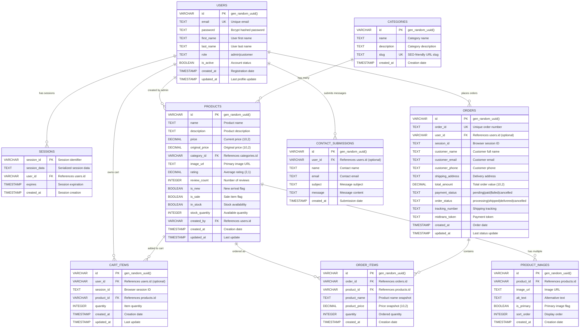

# 📊 Flowchart Sistem Hurtrock Music Store

**Copyright © 2024 Fajar Julyana. All rights reserved.**

## 🛒 Alur Pengguna (User Flow)

### **1. Alur Autentikasi Pengguna**

```mermaid
flowchart TD
    A[👤 Pengguna Mengakses Website] --> B[🏠 Halaman Beranda]
    B --> C{🔐 Sudah Login?}

    C -->|Ya| D[✅ Dashboard User/Lanjut Belanja]
    C -->|Tidak| E{📝 Pilih Aksi}

    E -->|Register| F[📝 Form Registrasi]
    E -->|Login| G[🔑 Form Login]
    E -->|Guest| H[🛒 Belanja sebagai Guest]

    F --> I[📧 Input Email, Password, Nama]
    I --> J[✅ Validasi Data dengan Zod]
    J --> K{✅ Valid?}

    K -->|Ya| L[🔐 Hash Password dengan Bcrypt]
    K -->|Tidak| M[⚠️ Tampilkan Error Validasi]

    L --> N[💾 Simpan User ke PostgreSQL]
    N --> O[🎫 Buat Session]
    O --> P[✅ Redirect ke Dashboard]

    G --> Q[📧 Input Email & Password]
    Q --> R[🔍 Cek Database User]
    R --> S{👤 User Exists?}

    S -->|Ya| T[🔐 Verify Password dengan Bcrypt]
    S -->|Tidak| U[❌ User Tidak Ditemukan]

    T --> V{✅ Password Benar?}
    V -->|Ya| O
    V -->|Tidak| W[❌ Password Salah]

    M --> F
    U --> G
    W --> G
    H --> X[🛒 Akses Terbatas ke Katalog]

    style A fill:#f97316
    style P fill:#16a34a
    style U fill:#dc2626
    style W fill:#dc2626
```

### **2. Alur Belanja dengan Autentikasi**

```mermaid
flowchart TD
    A[👤 User Masuk Website] --> B{🔐 Status Login?}

    B -->|Logged In| C[🏠 Dashboard Personalized]
    B -->|Guest| D[🏠 Homepage Umum]

    C --> E[📦 Browse Produk dengan Rekomendasi]
    D --> F[📦 Browse Produk Umum]

    E --> G[🔍 Pencarian/Filter Produk]
    F --> G

    G --> H[📱 Lihat Detail Produk]
    H --> I{🛒 Tambah ke Keranjang?}

    I -->|Ya| J{👤 User Logged In?}
    I -->|Tidak| K[⬅️ Kembali ke Katalog]

    J -->|Ya| L[➕ Simpan ke Cart dengan User ID]
    J -->|Tidak| M[➕ Simpan ke Session Cart]

    L --> N{🛍️ Lanjut Belanja?}
    M --> N

    N -->|Ya| K
    N -->|Tidak| O[🛒 Review Keranjang]

    O --> P{💸 Checkout?}
    P -->|Ya| Q{👤 User Logged In?}
    P -->|Tidak| R[❌ Tutup Keranjang]

    Q -->|Ya| S[📝 Data Sudah Tersimpan]
    Q -->|Tidak| T[📝 Input Data Pembeli]

    S --> U[💳 Pilih Metode Pembayaran]
    T --> U

    U --> V[🔒 Proses Pembayaran Midtrans]
    V --> W{✅ Pembayaran Berhasil?}

    W -->|Ya| X[📦 Create Order dengan Status]
    W -->|Tidak| Y[❌ Pembayaran Gagal]

    X --> Z[✉️ Email Konfirmasi]
    Z --> AA[📱 Update Dashboard User]

    Y --> U
    R --> C
    K --> C

    style A fill:#f97316
    style AA fill:#16a34a
    style Y fill:#dc2626
```

### **3. Alur Role-Based Admin Access**

```mermaid
flowchart TD
    A[👨‍💼 Admin Akses /admin] --> B{🔐 Sudah Login?}

    B -->|Ya| C{👤 Role Check}
    B -->|Tidak| D[📝 Form Login]

    C -->|Admin| E[📊 Admin Dashboard Access]
    C -->|Customer| F[❌ Access Denied]

    D --> G[📧 Input Credentials]
    G --> H[🔍 Validate User & Role]
    H --> I{✅ Valid Admin?}

    I -->|Ya| J[🎫 Create Admin Session]
    I -->|Tidak| K[❌ Unauthorized]

    J --> E

    E --> L{🎯 Pilih Admin Function}

    L -->|Products| M[📦 Product Management]
    L -->|Categories| N[📂 Category Management]
    L -->|Orders| O[📋 Order Management]
    L -->|Users| P[👥 User Management]
    L -->|Analytics| Q[📊 Dashboard Analytics]

    M --> R[➕ CRUD Products dengan Images]
    N --> S[➕ CRUD Categories]
    O --> T[📋 Track & Update Order Status]
    P --> U[👥 Manage User Roles & Permissions]
    Q --> V[📈 View Sales Analytics]

    F --> W[🔄 Redirect to Home]
    K --> D

    style A fill:#f97316
    style E fill:#16a34a
    style F fill:#dc2626
    style K fill:#dc2626
```

### **4. Alur Manajemen Profil User**

```mermaid
flowchart TD
    A[👤 User Login] --> B[📱 Akses Profile Menu]
    B --> C{📋 Pilih Action}

    C -->|View Profile| D[👁️ Lihat Data Profil]
    C -->|Edit Profile| E[✏️ Form Edit Profil]
    C -->|Order History| F[📋 Riwayat Pesanan]
    C -->|Change Password| G[🔐 Form Ganti Password]

    E --> H[📝 Update Data Profil]
    H --> I[✅ Validasi dengan Zod]
    I --> J{✅ Valid?}

    J -->|Ya| K[💾 Update Database]
    J -->|Tidak| L[⚠️ Show Validation Errors]

    K --> M[✅ Profile Updated Success]
    L --> E

    G --> N[🔐 Input Old & New Password]
    N --> O[🔍 Verify Old Password]
    O --> P{✅ Old Password Correct?}

    P -->|Ya| Q[🔐 Hash New Password]
    P -->|Tidak| R[❌ Wrong Password]

    Q --> S[💾 Update Password in DB]
    S --> T[✅ Password Changed]

    F --> U[📋 Display Order List dengan Status]
    U --> V[👁️ View Order Details]

    R --> G

    style A fill:#f97316
    style M fill:#16a34a
    style T fill:#16a34a
    style R fill:#dc2626
```

## 📊 Enhanced System Architecture

### **5. Alur Authentication & Session Management**

```mermaid
flowchart TB
    subgraph "🔐 Authentication Layer"
        A1[📝 User Registration/Login]
        A2[🔐 Bcrypt Password Processing]
        A3[🎫 Session Creation]
        A4[👤 Role Assignment]
    end

    subgraph "💾 Session Storage (PostgreSQL)"
        B1[🗄️ Sessions Table]
        B2[🛒 Cart Session Linking]
        B3[👤 User Session State]
        B4[⏰ Session Expiry Management]
    end

    subgraph "🛡️ Authorization Layer"
        C1[🔍 Role-based Access Control]
        C2[📊 Admin Route Protection]
        C3[👤 User Route Protection]
        C4[🛒 Cart Access Control]
    end

    subgraph "🌐 Client State Management"
        D1[⚛️ React Auth Context]
        D2[🔄 TanStack Query Cache]
        D3[🛒 Cart State Sync]
        D4[🌍 Localization State]
    end

    A1 --> B1
    A2 --> B3
    A3 --> C1
    A4 --> C2

    B1 --> D1
    B2 --> D3
    B3 --> D2
    B4 --> D4

    C1 --> D1
    C2 --> D2
    C3 --> D3
    C4 --> D4

    style A1 fill:#3b82f6
    style B1 fill:#16a34a
    style C1 fill:#f59e0b
    style D1 fill:#8b5cf6
```

### **6. Enhanced Database Architecture dengan User Management**

### **7. Enhanced Security Flow**

```mermaid
flowchart TD
    A[🌐 Incoming Request] --> B[🔍 Express.js Input Validation]
    B --> C[📊 Zod Schema Validation]
    C --> D{✅ Input Valid?}

    D -->|Ya| E{🔐 Authentication Required?}
    D -->|Tidak| F[❌ Return Validation Error]

    E -->|Ya| G[🎫 Check Session Cookie]
    E -->|Tidak| H[📡 Process Public Request]

    G --> I{👤 Valid Session?}
    I -->|Ya| J[🔍 Load User from Database]
    I -->|Tidak| K[❌ Unauthorized Response]

    J --> L{🛡️ Authorization Required?}
    L -->|Ya| M[👤 Check User Role & Permissions]
    L -->|Tidak| H

    M --> N{✅ Authorized?}
    N -->|Ya| H
    N -->|Tidak| O[❌ Forbidden Response]

    H --> P[🗄️ Drizzle ORM Safe Query]
    P --> Q[🛡️ SQL Injection Prevention]
    Q --> R[🔐 Password Hash Protection]
    R --> S[📤 Return Sanitized Response]

    F --> T[🚨 Log Security Event]
    K --> T
    O --> T

    style A fill:#f97316
    style S fill:#16a34a
    style F fill:#dc2626
    style K fill:#dc2626
    style O fill:#dc2626
    style T fill:#dc2626
```

### **8. Real-time State Synchronization**

```mermaid
flowchart LR
    subgraph "📱 Frontend State"
        A1[⚛️ React Auth Context]
        A2[🛒 Cart State Management]
        A3[🌍 Localization Context]
        A4[📊 TanStack Query Cache]
    end

    subgraph "🔄 API Layer Sync"
        B1[🔐 Authentication Endpoints]
        B2[🛒 Cart Management API]
        B3[👤 User Profile API]
        B4[📦 Products API with Caching]
    end

    subgraph "💾 Database State"
        C1[👤 Users & Sessions Table]
        C2[🛒 Cart Items Table]
        C3[📦 Products & Categories]
        C4[📋 Orders & Tracking]
    end

    subgraph "🌐 Real-time Updates"
        D1[🔄 Auto-refresh on Auth Change]
        D2[⚡ Optimistic UI Updates]
        D3[🔄 Background Data Sync]
        D4[📱 Cross-tab Synchronization]
    end

    A1 <--> B1
    A2 <--> B2
    A3 <--> B3
    A4 <--> B4

    B1 <--> C1
    B2 <--> C2
    B3 <--> C3
    B4 <--> C4

    A1 <--> D1
    A2 <--> D2
    A3 <--> D3
    A4 <--> D4

    style A1 fill:#3b82f6
    style B1 fill:#16a34a
    style C1 fill:#f59e0b
    style D1 fill:#8b5cf6
```

---

**🎯 Key Enhancements dalam Flowchart:**

1. **Complete Authentication System**: User registration, login, dan session management
2. **Role-based Access Control**: Admin dan customer dengan proper authorization
3. **Enhanced Security**: Bcrypt password hashing dan comprehensive validation
4. **Profile Management**: User dapat mengelola profil dan melihat order history
5. **Advanced Admin Panel**: Complete product, category, order, dan user management
6. **Real-time State Sync**: TanStack Query dengan optimistic updates
7. **Session-based Cart**: Persistent cart bahkan setelah logout/login
8. **Enhanced Database Design**: Comprehensive ERD dengan user relationships

---

**Developed by Fajar Julyana**

*Flowchart terbaru ini mencerminkan evolusi sistem menjadi platform e-commerce yang fully-featured dengan keamanan enterprise-level dan user experience yang optimal.*