# 👤 User Manual - Hurtrock Music Store

**Copyright © 2024 Fajar Julyana. All rights reserved.**

## 📖 Panduan Lengkap Pengguna

Selamat datang di Hurtrock Music Store! Panduan ini akan membantu Anda menavigasi website, membuat akun, dan berbelanja alat musik rock vintage dengan mudah.

## 🔐 Membuat Akun dan Login

### **Mendaftar Akun Baru:**

1. **Akses Halaman Register:**
   - Klik tombol "Login/Register" di header website
   - Pilih tab "Register" jika belum memiliki akun

2. **Isi Form Registrasi:**
   ```
   Required Information:
   ├── First Name (Nama Depan) *
   ├── Last Name (Nama Belakang) *
   ├── Email Address *
   └── Password (min. 6 karakter) *
   ```

3. **Submit dan Verifikasi:**
   - Klik tombol "Register"
   - Sistem akan otomatis login setelah registrasi berhasil
   - Anda akan diarahkan ke dashboard atau homepage

### **Login ke Akun Existing:**

1. **Akses Halaman Login:**
   - Klik tombol "Login" di header
   - Atau kunjungi halaman login langsung

2. **Masukkan Credentials:**
   - Email address yang terdaftar
   - Password akun Anda

3. **Fitur Login:**
   - Remember me (session akan bertahan lebih lama)
   - Forgot password (jika tersedia)
   - Auto-redirect ke halaman sebelumnya

### **Keamanan Akun:**
- **Password Requirements**: Minimal 6 karakter dengan kombinasi huruf dan angka
- **Session Management**: Otomatis logout setelah periode inactive
- **Secure Cookies**: Data session disimpan dengan aman
- **Password Hashing**: Password di-encrypt dengan teknologi bcrypt

## 🏠 Dashboard dan Profile Management

### **Dashboard Pengguna:**

Setelah login, Anda akan memiliki akses ke dashboard personal dengan fitur:

```
Dashboard Features:
├── 👤 Profile Summary
├── 📦 Recent Orders
├── 🛒 Saved Cart Items
├── ❤️ Wishlist (coming soon)
├── 📧 Account Settings
└── 🔐 Security Settings
```

### **Mengelola Profil:**

#### **1. Melihat Profil:**
- Klik icon user di header
- Pilih "Profile" dari dropdown menu
- View informasi akun lengkap

#### **2. Edit Profil:**
- Klik tombol "Edit Profile"
- Update informasi yang diperlukan:
  ```
  Editable Fields:
  ├── First Name
  ├── Last Name
  ├── Email Address
  ├── Phone Number (optional)
  └── Profile Picture (coming soon)
  ```

#### **3. Ganti Password:**
- Pilih "Change Password" di settings
- Masukkan password lama
- Masukkan password baru (2x untuk konfirmasi)
- Password akan di-update secara secure

#### **4. Order History:**
- View semua pesanan yang pernah dibuat
- Track status pesanan real-time
- Download invoice (jika tersedia)
- Reorder functionality

## 🛒 Enhanced Shopping Experience

### **Belanja sebagai Registered User:**

#### **Keuntungan Login:**
- **Personalized Recommendations**: Produk yang disesuaikan dengan preferensi
- **Saved Cart**: Keranjang tersimpan meskipun logout
- **Order Tracking**: Lihat status pesanan real-time
- **Faster Checkout**: Data alamat tersimpan otomatis
- **Exclusive Offers**: Promo khusus member terdaftar

#### **Shopping Flow untuk User Terdaftar:**

```mermaid
flowchart TD
    A[👤 Login User] --> B[🏠 Personalized Homepage]
    B --> C[📦 Browse dengan Rekomendasi]
    C --> D[🛒 Add to Cart dengan User ID]
    D --> E[💸 Express Checkout]
    E --> F[📦 Order Confirmation]
    F --> G[📱 Track Order di Dashboard]
```



### **Cart Management untuk User Login:**

#### **Persistent Cart:**
- Cart items tersimpan di database dengan user ID
- Items tetap ada meskipun logout/login ulang
- Sync cart across multiple devices
- Merge cart jika ada items dari guest session

#### **Advanced Cart Features:**
- **Save for Later**: Pindahkan item ke wishlist
- **Quick Add**: Tambah item yang pernah dibeli sebelumnya
- **Price Alerts**: Notifikasi jika harga turun
- **Stock Notifications**: Alert jika stock tersedia kembali

## 🚀 Fitur-Fitur Terbaru

### **1. Personalization Engine:**
- **Smart Recommendations**: Berdasarkan purchase history dan browsing behavior
- **Category Preferences**: System belajar preferensi kategori musik Anda
- **Brand Affinity**: Rekomendasi brand berdasarkan pembelian sebelumnya

### **2. Enhanced Search & Discovery:**
- **Search History**: Simpan pencarian yang sering dilakukan
- **Advanced Filters**: Filter berdasarkan brand, harga, rating, dll
- **Visual Search**: Upload foto untuk cari produk serupa (coming soon)

### **3. Social Features:**
- **Product Reviews**: Tulis dan baca review dari pembeli lain
- **Rating System**: Rate produk yang sudah dibeli
- **Share Favorites**: Share produk favorit ke social media

### **4. Mobile-First Experience:**
- **Progressive Web App**: Install website sebagai mobile app
- **Touch Optimized**: Interface yang dioptimalkan untuk touch
- **Offline Browsing**: Browse katalog meskipun offline

## 💳 Enhanced Payment & Checkout

### **Express Checkout untuk User Login:**

#### **One-Click Checkout:**
- Data alamat dan payment method tersimpan aman
- Checkout hanya dengan 1-2 klik
- Multiple shipping addresses support
- Payment method preferences

#### **Advanced Payment Features:**
- **Payment History**: Lihat history semua pembayaran
- **Payment Methods**: Simpan multiple credit card/e-wallet
- **Auto-fill**: Data billing otomatis terisi
- **Payment Reminders**: Reminder untuk payment yang pending

### **Order Management:**

#### **Real-time Order Tracking:**
```
Order Status Flow:
├── 📝 Order Placed
├── 💳 Payment Confirmed
├── 📦 Processing
├── 🚚 Shipped
├── 📍 Out for Delivery
└── ✅ Delivered
```

#### **Order Actions:**
- **Cancel Order**: Cancel order sebelum diproses
- **Modify Order**: Edit alamat atau items (jika memungkinkan)
- **Reorder**: Order ulang produk yang sama
- **Return Request**: Request return/refund

## 📱 Mobile App Experience

### **Progressive Web App (PWA):**

#### **Installation:**
- Buka website di mobile browser
- Klik "Add to Home Screen" di browser menu
- Icon Hurtrock Music Store akan muncul di home screen
- Experience seperti native mobile app

#### **Mobile-Specific Features:**
- **Push Notifications**: Notifikasi untuk order updates, promo, dll
- **Offline Mode**: Browse katalog meskipun tidak ada internet
- **Camera Integration**: Scan barcode atau QR code produk
- **Location Services**: Auto-detect alamat untuk shipping

## 🌍 Multi-Language & Currency

### **Enhanced Localization:**

#### **Smart Language Detection:**
- **Auto-detect**: Berdasarkan browser language dan location
- **Manual Selection**: Pilih bahasa di header (ID/EN)
- **Persistent Preference**: Pilihan bahasa tersimpan di akun

#### **Currency & Pricing:**
- **Dynamic Currency**: IDR untuk Indonesia, USD untuk international
- **Real-time Conversion**: Update rate currency real-time
- **Tax Calculation**: Auto-calculate tax berdasarkan lokasi
- **Local Payment Methods**: Payment methods sesuai region

## 🎯 Tips & Best Practices

### **Untuk Pemula:**

#### **Getting Started:**
1. **Create Account**: Daftar akun untuk experience terbaik
2. **Complete Profile**: Isi profil lengkap untuk rekomendasi yang akurat
3. **Explore Categories**: Browse setiap kategori untuk familiarize
4. **Read Reviews**: Baca review sebelum membeli
5. **Check Specifications**: Perhatikan spec teknis produk musik

#### **Smart Shopping:**
- **Compare Products**: Gunakan comparison feature
- **Check Stock**: Perhatikan stock availability
- **Read Return Policy**: Pahami kebijakan return/exchange
- **Subscribe Newsletter**: Dapat info promo dan new arrivals

### **Untuk Advanced Users:**

#### **Pro Tips:**
- **Use Filters**: Manfaatkan advanced filtering untuk pencarian efisien
- **Set Price Alerts**: Setup alert untuk produk yang diinginkan
- **Bulk Ordering**: Order multiple items sekaligus untuk discount
- **Track Price History**: Monitor price changes produk favorit

#### **Power User Features:**
- **API Access**: Developer API untuk integrations (coming soon)
- **Bulk Import**: Import wishlist dari file CSV
- **Advanced Analytics**: Personal analytics untuk spending patterns

## ❓ Enhanced FAQ

### **🔐 Account & Security:**

**Q: Bagaimana cara reset password jika lupa?**
A: Klik "Forgot Password" di halaman login, masukkan email, dan ikuti instruksi di email yang dikirim.

**Q: Apakah data personal saya aman?**
A: Ya, kami menggunakan enkripsi SSL dan password di-hash dengan bcrypt. Data tidak dibagikan ke pihak ketiga.

**Q: Bisakah saya menghapus akun?**
A: Ya, hubungi customer service untuk request penghapusan akun sesuai GDPR compliance.

### **🛒 Shopping & Orders:**

**Q: Bagaimana cara track pesanan?**
A: Login ke akun, pilih "Order History" di dashboard, dan klik order yang ingin di-track.

**Q: Bisakah mengubah pesanan setelah checkout?**
A: Perubahan hanya bisa dilakukan sebelum status "Processing". Hubungi customer service segera.

**Q: Apa itu Express Checkout?**
A: Fitur checkout cepat untuk user terdaftar dengan data alamat dan payment tersimpan.

### **📱 Technical Support:**

**Q: Kenapa website lambat loading?**
A: Clear browser cache, gunakan browser terbaru, atau coba akses di lain waktu saat traffic rendah.

**Q: Bagaimana cara install mobile app?**
A: Buka website di mobile browser, pilih "Add to Home Screen" untuk install PWA.

**Q: Fitur apa yang tersedia offline?**
A: Browse katalog dan lihat order history tersedia offline di PWA mode.

## 📞 Customer Support

### **Multiple Support Channels:**

#### **Live Chat (Coming Soon):**
- **Instant Support**: Chat real-time dengan customer service
- **AI Chatbot**: Auto-response untuk pertanyaan umum
- **Business Hours**: Senin-Jumat 09:00-17:00 WIB

#### **Email Support:**
- **General Inquiry**: info@hurtrockstore.com
- **Technical Support**: tech@hurtrockstore.com
- **Order Issues**: orders@hurtrockstore.com
- **Response Time**: 24-48 jam

#### **WhatsApp Support:**
- **Number**: +62821-1555-8035
- **Available**: Jam operasional toko
- **Best For**: Urgent inquiries dan order support

#### **In-App Support:**
- **Help Center**: Comprehensive FAQ dan tutorials
- **Support Tickets**: Submit dan track support requests
- **Video Tutorials**: Step-by-step guides untuk fitur utama

---

## 🎸 Selamat Berbelanja!

Dengan fitur-fitur terbaru ini, experience berbelanja di Hurtrock Music Store akan jauh lebih personal, aman, dan convenient. Kami terus mengembangkan platform untuk memberikan experience terbaik bagi komunitas musisi rock Indonesia.

**Rock on with confidence! 🤘**

---

**Developed by Fajar Julyana**

*User manual ini akan terus diupdate seiring dengan rilis fitur-fitur baru. Feedback Anda sangat berharga untuk peningkatan platform.*
